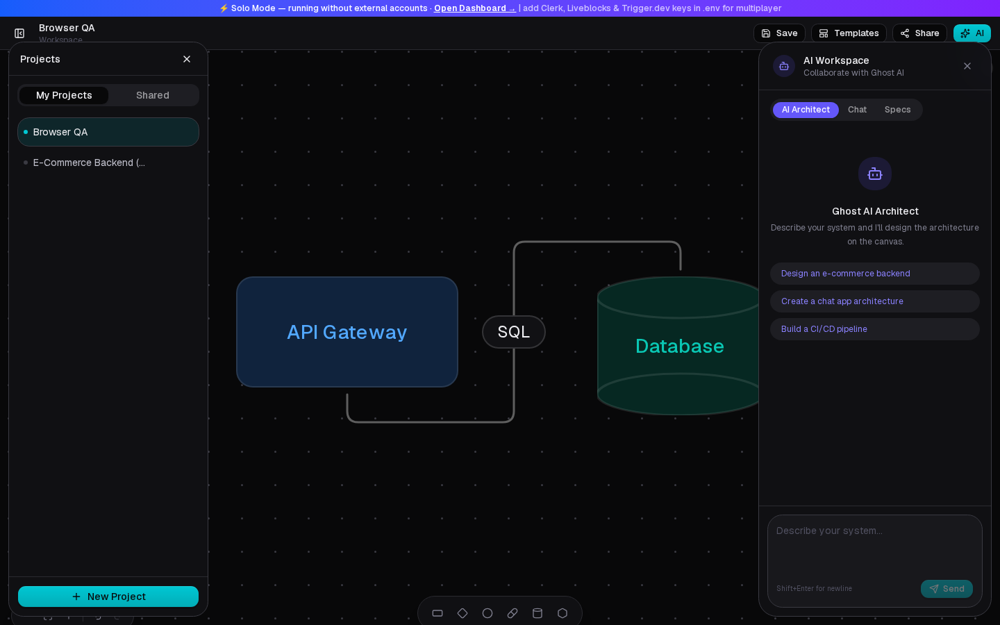
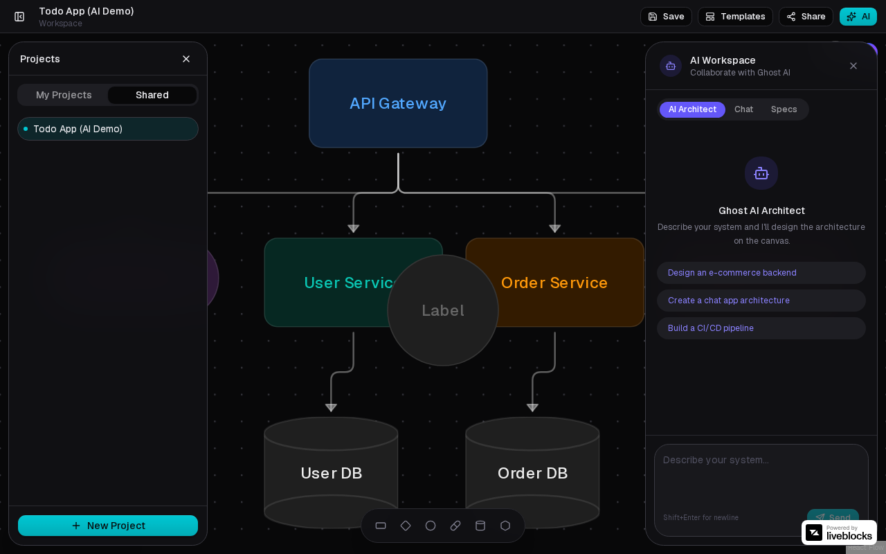
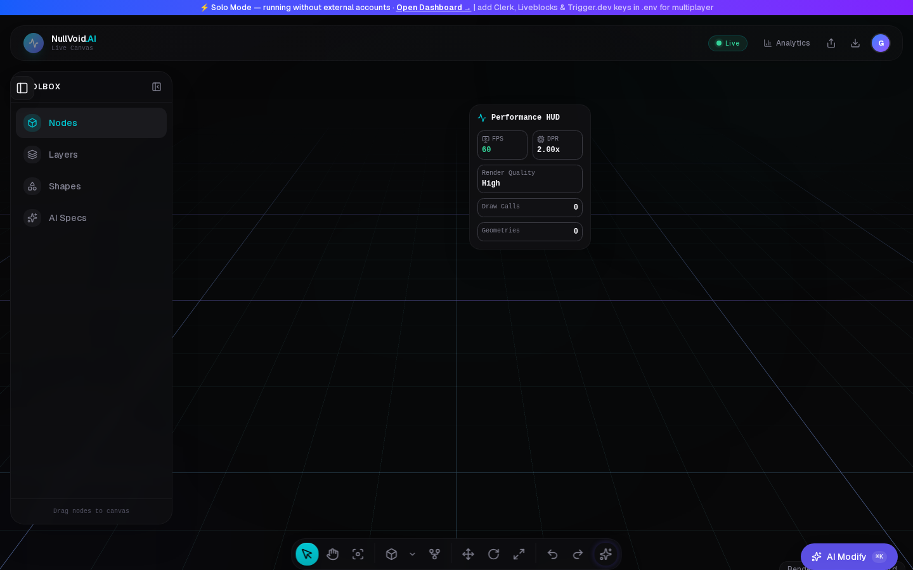

# NullVoid AI

**AI-powered collaborative system design workspace.** Describe an architecture in plain English — an AI agent draws it as an interactive diagram on a real-time multiplayer canvas, and exports a complete Markdown technical specification.



## 🔗 Live Demo

> **[nullvoid-ai.vercel.app](#deployment)** — *(deploy in ~15 min, see [Deployment](#deployment))*
>
> Or run locally in solo mode with just two things: a Postgres database and a free [Gemini API key](https://aistudio.google.com/apikey).

## How to Use

1. **Sign in** (Clerk) or continue as guest in solo mode
2. **Create a project** from the dashboard
3. Open the editor and **type a prompt** in the AI sidebar — e.g. *"Design a scalable e-commerce backend with payments and a message queue"*
4. Watch the AI place **nodes and edges on the canvas** (~20–30s)
5. Refine by hand: drag-drop shapes, connect edges, rename inline, undo/redo
6. **Share** → invite teammates by email → they edit the same canvas live (cursors + presence)
7. **Specs tab → Generate** → preview and **download a Markdown tech spec** built from your diagram

| Multiplayer (teammate's view) | 3D canvas (60 FPS WebGL) |
|---|---|
|  |  |

## Features

- **AI architecture generation** — Gemini tool-calling agent places typed, colored, positioned nodes/edges
- **Real-time collaboration** — Liveblocks CRDT rooms: live cursors, presence, simultaneous editing
- **2D + 3D canvases** — React Flow editor and a Three.js/WebGPU scene with LOD and instancing
- **Spec generation** — one-click Markdown technical specification from the live canvas graph
- **Iterative AI chat** — delta-patch modifications ("add a Redis cache to the product service")
- **Project management** — auth, ownership, email-invited collaborators, starter templates, autosave

## Engineering Highlights

The parts I'd want a code reviewer to look at:

- **Dual-mode runtime** (`lib/runtime.ts`, `lib/collab/`) — every external service degrades gracefully. No Liveblocks key? A local store with identical hook semantics (mock CRDT, undo history, feeds) takes over. No Trigger.dev? AI jobs execute inline in the API route. No Blob storage? Canvases/specs persist to Postgres. Add keys → features upgrade automatically, zero code changes.
- **LLM resilience** (`lib/ai/model-fallback.ts`) — model candidate chain with cooldown memory: quota-exhausted models (429) are skipped for 30 min, overloaded ones (503) for 2 min, so requests fail over in milliseconds instead of retrying dead models.
- **Defense in depth** — per-user sliding-window rate limits on all AI routes, input size caps, 2 MB canvas payload limit, room↔project authorization binding, Zod-validated AI outputs with lenient normalization.
- **Tested like production** (`scripts/qa/`) — Playwright suites run against the production build: page/console-error sweeps, drag-drop, inline label editing, template import, full AI-prompt→canvas E2E, and a **two-authenticated-browser multiplayer test** that verifies a shape dropped by one user appears on the other's screen.

## Tech Stack

| Layer | Technology |
|---|---|
| Framework | Next.js 16 (App Router, Turbopack), React 19, TypeScript |
| UI | Tailwind CSS v4, shadcn/ui, React Flow (@xyflow/react), Three.js / React Three Fiber |
| AI | Google Gemini via Vercel AI SDK (multi-step tool calling) + @google/genai |
| Realtime | Liveblocks (CRDT storage, presence, feeds) |
| Auth | Clerk |
| Data | PostgreSQL + Prisma 7 (driver adapters), Vercel Blob (optional) |
| Jobs | Trigger.dev (optional — inline fallback built in) |
| Quality | GitHub Actions CI (typecheck → lint → tests → build), Vitest, Playwright |

## Getting Started

```bash
git clone https://github.com/bruce12-glitch/nullvoid.AI.git
cd nullvoid.AI
bash scripts/dev-setup.sh      # local Postgres + deps + migrations
cp .env.example .env           # set DATABASE_URL + GOOGLE_GENERATIVE_AI_API_KEY
npm run dev
```

That's a fully working solo-mode app. For accounts + multiplayer, also set the Clerk and Liveblocks keys in `.env` (all documented in [`.env.example`](.env.example)).

```bash
npm run test:unit   # vitest
npm run lint        # eslint (0 errors)
npm run build       # production build
node scripts/qa/browser-qa.mjs   # headless-browser page sweep (needs: npx playwright install chromium)
```

## Deployment

1. **Database** — create a free Postgres at [neon.tech](https://neon.tech), run `npx prisma migrate deploy`
2. **Vercel** — import this repo, paste your `.env` values as Environment Variables, deploy
3. CI already gates `main`: every push runs typecheck → lint → unit tests → build

## Project Structure

```
app/            routes + API (projects, canvas, specs, 5 AI endpoints, auth, health)
components/     canvas (3D), editor (2D + AI sidebar), dashboard, ui
lib/ai/         design engine, spec engine, model fallback, delta patcher
lib/collab/     Liveblocks facade + solo-mode engine (the dual-mode core)
lib/            runtime detection, rate limiting, db, auth-ui facade
prisma/         schema + migrations
scripts/qa/     Playwright E2E suites (pages, interactions, AI flow, multiplayer)
trigger/        background job definitions (optional path)
```

## Known Limitations

- Gemini free tier: 20 requests/day/model — the fallback chain stretches this, but sustained team usage needs a paid key
- Liveblocks public-key mode (default config) trades per-room permission enforcement for zero-setup collab; supply `LIVEBLOCKS_SECRET_KEY` to enable server-signed room access
- In-memory rate limiting is per-instance; swap for Redis when scaling horizontally

---

